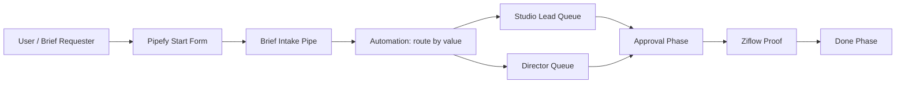

# Technical Specification — <CLIENT_NAME> · <ENGAGEMENT_NAME>

> Stage 5 of the dydx-delivery pipeline. Maps the functional spec onto the chosen platform. Every functional requirement must trace to a concrete platform construct.

---

## 1. Architecture overview

<One-paragraph narrative describing the diagram, the trigger points, and the data flow.>

---

## 2. Platform constructs

> Use the platform's actual vocabulary (loaded from `platform-<platform>` skill).

### 2.1 Primary objects

| Construct | Name | Purpose |
|---|---|---|
| <Pipe / Project> | Brief Intake | Main work pipeline |
| <Database / Table> | Approver Roster | Source of truth for approvers + delegates |
| <Connection field / Cross-tag> | Brief → Approver | Resolves approver per BR-2/3 |

### 2.2 Phases / states

| State (functional) | Construct (platform) | Notes |
|---|---|---|
| Draft | <Phase: Draft> | Manual save, no automation |
| Submitted | <Phase: Submitted> | Auto on form submit |
| In Review | <Phase: In Review> | Studio Lead / Director queue |
| Approved | <Phase: Approved> | Gated by approval action |
| Rejected | <Phase: Rejected> | Terminal |
| Done | <Phase: Done> | Terminal |

---

## 3. Field mappings

| Functional field | Platform field | Type | Validation | Default | Source |
|---|---|---|---|---|---|
| Brief title | `title` | Short text | Min 5 / max 120 chars | — | Form input |
| Description | `description` | Long text | Min 20 chars | — | Form input |
| Deadline | `deadline` | Date | Future, max 90d out | — | Form input |
| Requesting team | `requesting_team` | Single select | From team list | User's primary team | Form input |
| Estimated value | `value` | Currency | ≥ 0 | 0 | Form input |
| Priority | `priority` | Single select | High / Medium / Low | Medium | Form input |
| State | (phase) | — | — | Draft | System |
| Approver | `approver` | Connection field → Approver Roster | Resolved per BR-2/3 | — | Automation |

---

## 4. Automation logic

> Each entry maps to a business rule from the functional spec.

### 4.1 BR-1 — Mandatory field validation

- **Construct:** Form-level validation (no automation needed)
- **Trigger:** Form submit
- **Behaviour:** Browser-side + platform validation rejects submission if any mandatory field empty
- **Failure mode:** User sees inline error per field

### 4.2 BR-3 — Routing by value

- **Construct:** <Automation: when card created, condition value > 50000, action move to Director Queue, else move to Studio Lead Queue>
- **Trigger:** Phase transition `Submitted → In Review`
- **Failure mode:** If routing fails (e.g. queue not found), log error, leave in `Submitted`, notify Ops

### 4.3 BR-4 — SLA breach escalation

- **Construct:** <Scheduled automation: every 1h check `phase = In Review` and `phase_age > 48h`, escalate to delegate>
- **Trigger:** Time-based
- **Failure mode:** If delegate also OoO, escalate to next-level manager (per open question OQ-1)

### 4.4 BR-5 — OoO delegate routing

- **Construct:** <Automation: on approval request creation, lookup approver in Approver Roster, if `out_of_office = true`, replace `approver` with `delegate`>
- **Trigger:** Card enters `In Review` phase
- **Failure mode:** If delegate field empty, raise validation error

---

## 5. Integration contracts

### 5.1 Ziflow

| Item | Detail |
|---|---|
| Endpoint | `POST /api/v2/projects` |
| Trigger | Card enters `Approved` phase |
| Auth | API key (stored in <secrets store>) |
| Payload | `{ project_name, files: [...], reviewers: [...] }` |
| Idempotency | Use `card_id` as `client_request_id` |
| Retries | 3x with exponential backoff (1s, 2s, 4s) |
| Failure path | After 3 retries, log to <support pipe>, notify Ops via Slack `#ops-alerts` |
| Rate limit | 100 req/min per tenant — buffer at 80 |

### 5.2 <Next integration>

<Repeat structure>

---

## 6. Error handling and observability

| Edge case (from functional spec) | Detection point | Logged where | User sees | Support sees |
|---|---|---|---|---|
| EC-3: Ziflow 5xx | Integration retry handler | <Logging system> | "We're processing your brief" (no error) | Slack alert + `#ops-alerts` thread |
| EC-2: Approver OoO no delegate | BR-5 automation | <Logging system> | "Awaiting approver assignment" | Daily digest of unassigned approvals |
| EC-4: Concurrent edit conflict | Last-write-wins handler | <Logging system> | Notification: "Your changes were overwritten by <user>" | Conflict log per pipe |

---

## 7. Security and access control

| Role | Pipe access | Field-level restrictions |
|---|---|---|
| Brief Requester | Read/write own cards | Cannot edit `approver`, `state`, `priority` |
| Studio Lead | Read/write team cards | Full edit |
| Director | Read/write Director queue | Full edit |
| Approver | Read assigned cards | Edit only `approval_decision`, `approval_notes` |
| Ops | Full | Full |

**Sensitive field masking:** <e.g. `value` field hidden from non-managerial roles>

---

## 8. Migration / data load

> If applicable.

- **Source:** <e.g. legacy spreadsheet at \\fileshare\briefs.xlsx>
- **Volume:** ~2,000 historical briefs
- **Strategy:** One-off import via Pipefy CSV import; map historical states to closest current states
- **Cutover:** <date>; legacy spreadsheet becomes read-only

---

## 9. Licence / tier dependencies

| Construct | Required tier | Confirmed? |
|---|---|---|
| Scheduled automation | Pipefy Business | <Yes / No> |
| Custom roles | Pipefy Business | <Yes / No> |
| API access | Pipefy Business | <Yes / No> |

---

## 10. Trade-offs and decisions

> Where we chose one approach over another, with reasoning.

- **Native conditional field vs automation for routing (BR-3)** — chose automation because it's testable in isolation and survives platform UI changes
- **Approver Roster as separate database vs inline field** — chose separate database for delegate management and reusability
- **Ziflow integration via webhook vs polling** — chose webhook (lower latency, simpler retry semantics)

---

## 11. Open technical questions

- [ ] OQ-1: Escalation chain when delegate is also OoO?
- [ ] OQ-2: Confirm Pipefy tenant has `Business` tier (required for scheduled automations)
- [ ] OQ-3: Confirm Ziflow API key + sandbox project for testing

---

## 12. Build sequence

> Suggested order for the implementation partner.

1. Provision pipes, phases, fields (no automations yet)
2. Build start form + validation
3. Set up Approver Roster database, seed with current approvers
4. Build automations BR-3, BR-5
5. Build Ziflow integration
6. Build SLA escalation automation (BR-4)
7. Hand off to test stage

---

## Handoff

When this technical spec is approved:

1. Update `status:` to `approved`
2. Confirm tenant access for the implementation partner
3. Run `generate-test-plan` to produce the test plan against this spec

**Next stage reads:** the highest-version `05_techspec_v*.md`.
